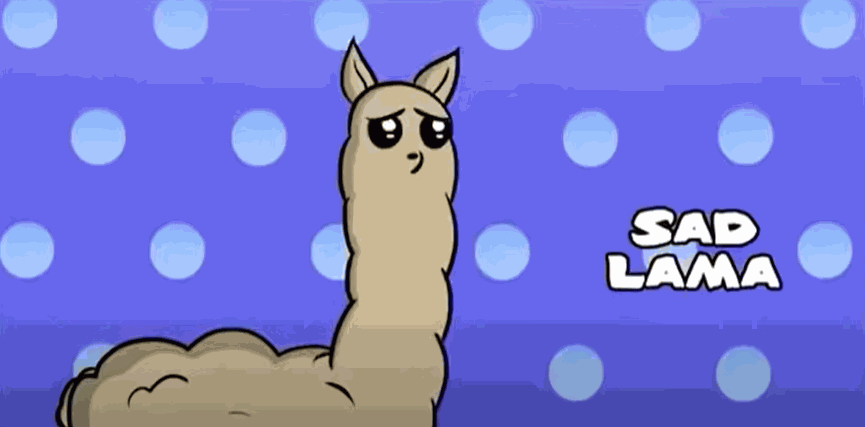

# GIF Generator

> This is the **third final project** I made for finishing my **Codedex journey**:  
It is a **GIF generator** that uses images to create GIFs. I used it to generate some funny GIFs!  

---

## Table of Contents

- [Features](#features)  
- [Demo](#demo)  
- [Future Updates](#future-updates)  
- [License](#license)  

---

## Features

- Combine multiple images to create GIFs  
- Customize the **frame duration** for each image  
- Save GIFs with a **custom file name**  
- Supports different image formats (JPEG, PNG, etc.)  

---

## Demo

Here’s an example of a generated GIF:  

  
  

You can use this tool to make funny GIFs, memes, or animations from your images.  

---

## Future Updates

- Add more customization options for GIF speed and loops  
- Support adding text or stickers to GIF frames  
- Add a GUI for easier use  
- Improve performance for large GIFs  

---

## License

This project is licensed under the MIT License.
