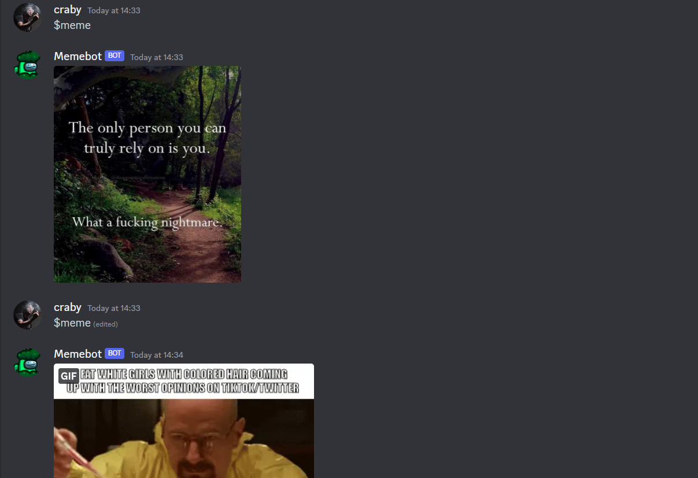
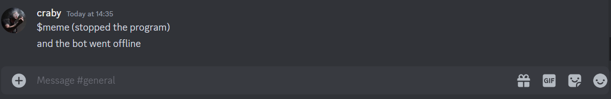

# Discord Meme Bot

> This is the **fourth final project** I made for finishing my **Codedex journey**:  
**"The Legend of Python"** is a **Discord meme bot** that gives you an image when you type `$meme`.  

---

## Table of Contents

- [Features](#features)  
- [Demo](#demo)  
- [Future Updates](#future-updates)  
- [License](#license)  

---

## Features

- `$meme` - Returns a random meme image  
- `$lofi` - Gives a random lofi music video from a lofi playlist (that I created locally)  
- `$roll` - Rolls a random number between two numbers you input  
- `$nicecock` - A fun meme command to congratulate the bot for doing its job 👍🏾 

---

## Demo

Here’s an example of the bot in action:  
You can use this bot to get memes, random numbers, and even lofi music recommendations on your Discord server.
  
.png)
  

---

## Future Updates

- Add more meme commands and content sources  
- Add moderation or utility commands  
- Improve randomization and API performance  
- Add logging and error handling for safer operation  

---

## License

This project is licensed under the MIT License.
