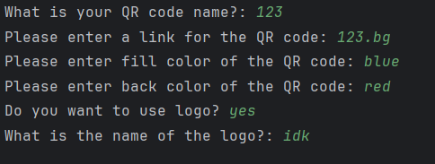

# QR Code Generator

> This is the **first final project** I made for finishing my **Codedex journey**:  
**"The Legend of Python"** is a **QR code generator**, and I used it to generate a QR code to my Instagram page!  

---

## Table of Contents

- [Features](#features)  
- [Demo](#demo)  
- [How to use](#how-to-use)
- [Future Updates](#future-updates)  
- [License](#license)  

---

## Features

- Generate QR codes for any URL  
- Customize the **file name** of the QR code image  
- Manually enter the **link** for the QR code  
- Choose **fill color** and **background color**  
- Optionally include a **logo** in the QR code  

---

## Demo

Here’s an example of a generated QR code:  

  

You can use this tool to generate QR codes for your website, social media pages, or any other links.  

---

## How to use

## Future Updates

- Add GUI interface for easier interaction  
- Allow multiple QR codes to be generated in batch  
- Support more file formats  
- Add error handling for invalid URLs or file paths  

---

## License
This project is licensed under the MIT License.
